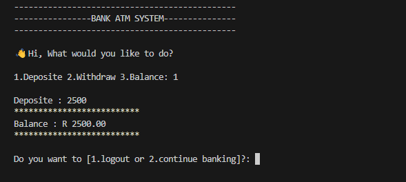
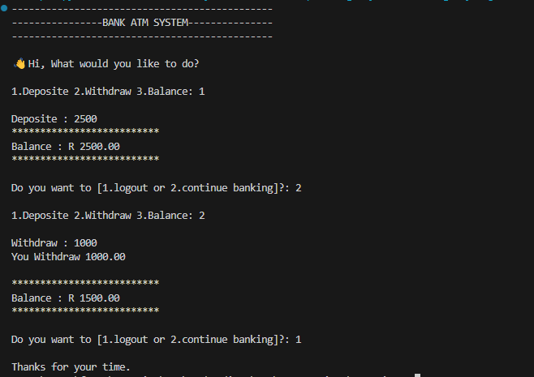
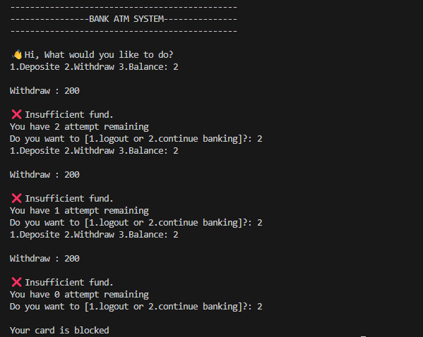

# ATM SYSTEM IN PYTHON

### Program functionality :
- This show case how atm operate
- It allows User to interact with their money
  
### How it Works :
1. Start by depositing money first
2. Then you can choose to check balance or withdraw money
3. Enter only a  number related to what you want to do
4. Contain 3 attempt function for better security

### Screenshots:

#### Deposite:

#### Withdraw:

#### User Error

#### Check Balance:

